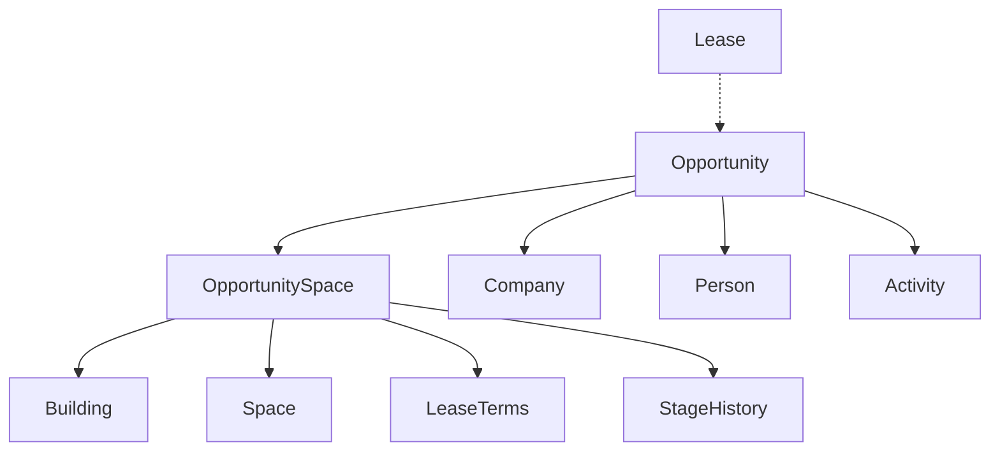

# CRMforCRE Technical Design Document

## Database Schema Design

### Core Entity Relationships



### Detailed Schema

#### Opportunity Table
```sql
CREATE TABLE opportunities (
  id UUID PRIMARY KEY,
  name VARCHAR(255) NOT NULL,
  stage VARCHAR(50) NOT NULL, -- System stage enum
  status VARCHAR(50) DEFAULT 'active',
  company_id UUID REFERENCES companies(id),
  total_sf VARCHAR(20), -- Calculated from OpportunitySpaces
  expected_value DECIMAL(12,2),
  target_close_date DATE,
  lease_start_date DATE,
  lease_expiration_date DATE,
  notes TEXT,
  created_at TIMESTAMP DEFAULT NOW(),
  updated_at TIMESTAMP DEFAULT NOW(),
  created_by UUID REFERENCES users(id)
);
```

#### OpportunitySpace Table (Junction - KEY INNOVATION)
```sql
CREATE TABLE opportunity_spaces (
  id UUID PRIMARY KEY,
  opportunity_id UUID REFERENCES opportunities(id),
  building_id UUID REFERENCES buildings(id),
  stage VARCHAR(50) NOT NULL, -- Individual stage per space
  reservation_status VARCHAR(20) DEFAULT 'available', -- available, reserved, competing
  last_updated TIMESTAMP DEFAULT NOW(),
  created_at TIMESTAMP DEFAULT NOW(),
  
  -- Lease terms specific to this space
  lease_type VARCHAR(50),
  proposed_term VARCHAR(50),
  base_rate VARCHAR(20),
  escalations VARCHAR(20),
  free_rent VARCHAR(20),
  ti_allowance VARCHAR(20)
);
```

#### OpportunitySpaceSpaces Table (Many-to-Many)
```sql
CREATE TABLE opportunity_space_spaces (
  id UUID PRIMARY KEY,
  opportunity_space_id UUID REFERENCES opportunity_spaces(id),
  space_id UUID REFERENCES spaces(id),
  created_at TIMESTAMP DEFAULT NOW()
);
```

#### Stage History Table
```sql
CREATE TABLE stage_history (
  id UUID PRIMARY KEY,
  opportunity_space_id UUID REFERENCES opportunity_spaces(id),
  from_stage VARCHAR(50),
  to_stage VARCHAR(50) NOT NULL,
  changed_at TIMESTAMP DEFAULT NOW(),
  changed_by UUID REFERENCES users(id),
  notes TEXT
);
```

#### Competition Tracking Table
```sql
CREATE TABLE space_competition (
  id UUID PRIMARY KEY,
  space_id UUID REFERENCES spaces(id),
  opportunity_id UUID REFERENCES opportunities(id),
  status VARCHAR(20) DEFAULT 'active', -- active, withdrawn, lost
  created_at TIMESTAMP DEFAULT NOW()
);
```

### System Stage Enums
```typescript
enum SystemStage {
  NEW = 'NEW',
  QUALIFIED = 'QUALIFIED', 
  NEGOTIATING = 'NEGOTIATING',
  LEASE_DRAFTING = 'LEASE_DRAFTING',
  CLOSED_WON = 'CLOSED_WON',
  CLOSED_LOST = 'CLOSED_LOST'
}

enum ReservationStatus {
  AVAILABLE = 'available',
  RESERVED = 'reserved',
  COMPETING = 'competing'
}
```

## API Design

### RESTful Endpoints

#### Opportunities
```typescript
GET /api/opportunities
POST /api/opportunities
GET /api/opportunities/:id
PUT /api/opportunities/:id
DELETE /api/opportunities/:id

// Stage management
PUT /api/opportunities/:id/spaces/:spaceId/stage
POST /api/opportunities/:id/spaces/:spaceId/stage-history

// Competition intelligence
GET /api/opportunities/:id/competition
GET /api/spaces/:spaceId/competing-opportunities
```

#### Real-time Updates
```typescript
// WebSocket events for real-time collaboration
EVENT: opportunity.stage.changed
EVENT: space.reservation.updated
EVENT: competition.alert
```

### Key API Responses

#### Opportunity Detail Response
```typescript
interface OpportunityDetailResponse {
  id: string
  name: string
  stage: SystemStage
  company: Company
  opportunitySpaces: OpportunitySpace[]
  contacts: Person[]
  totalSF: string
  expectedValue: string
  dates: OpportunityDates
  notes: string
  attachments: Attachment[]
  stageHistory: StageHistory[]
}

interface OpportunitySpace {
  id: string
  stage: SystemStage
  reservationStatus: ReservationStatus
  competingOpportunities: string[]
  lastUpdated: string
  building: Building
  spaces: Space[]
  leaseTerms: LeaseTerms
  stageHistory: StageHistory[]
}
```

## Frontend Architecture

### Component Hierarchy

```
App
├── Layout
│   ├── Sidebar
│   └── GlobalSearch
├── LeasingModule
│   ├── OpportunityBoard
│   │   ├── KanbanView
│   │   ├── TableView  
│   │   └── CalendarView
│   └── OpportunityDetail
│       ├── OpportunityHeader
│       ├── CompanyCard
│       ├── SpacePortfolio
│       │   └── SpaceCard (with stage management)
│       ├── ContactsList
│       ├── ActivityTimeline
│       └── AttachmentsList
```

### State Management Architecture

#### Zustand Store Design
```typescript
interface OpportunityStore {
  // State
  opportunities: Opportunity[]
  currentOpportunity: Opportunity | null
  stages: SystemStage[]
  loading: boolean
  error: string | null
  
  // Actions
  fetchOpportunities: () => Promise<void>
  fetchOpportunity: (id: string) => Promise<void>
  updateOpportunitySpaceStage: (
    opportunityId: string, 
    spaceId: string, 
    newStage: SystemStage
  ) => Promise<void>
  
  // Real-time subscriptions
  subscribeToOpportunity: (id: string) => void
  unsubscribeFromOpportunity: (id: string) => void
}
```

### Key Frontend Patterns

#### Stage Management Hook
```typescript
const useStageManagement = (opportunityId: string) => {
  const [isUpdating, setIsUpdating] = useState(false)
  
  const updateStage = async (spaceId: string, newStage: SystemStage) => {
    setIsUpdating(true)
    try {
      await api.updateOpportunitySpaceStage(opportunityId, spaceId, newStage)
      // Optimistic update
      updateLocalState(spaceId, newStage)
      // Add to stage history
      addStageHistory(spaceId, newStage)
    } catch (error) {
      // Revert optimistic update
      revertLocalState(spaceId)
      throw error
    } finally {
      setIsUpdating(false)
    }
  }
  
  return { updateStage, isUpdating }
}
```

#### Competition Intelligence Hook
```typescript
const useCompetitionIntelligence = (spaceId: string) => {
  const [competitors, setCompetitors] = useState<Opportunity[]>([])
  const [alertLevel, setAlertLevel] = useState<'none' | 'low' | 'medium' | 'high'>('none')
  
  useEffect(() => {
    fetchCompetingOpportunities(spaceId).then(setCompetitors)
  }, [spaceId])
  
  useEffect(() => {
    // Calculate alert level based on competitor count and stages
    const highStageCompetitors = competitors.filter(c => 
      ['NEGOTIATING', 'LEASE_DRAFTING'].includes(c.stage)
    )
    
    if (highStageCompetitors.length >= 2) setAlertLevel('high')
    else if (highStageCompetitors.length === 1) setAlertLevel('medium')
    else if (competitors.length > 0) setAlertLevel('low')
    else setAlertLevel('none')
  }, [competitors])
  
  return { competitors, alertLevel }
}
```

## Implementation Details

### Stage Transition Logic
```typescript
const STAGE_TRANSITIONS: Record<SystemStage, SystemStage[]> = {
  NEW: ['QUALIFIED', 'CLOSED_LOST'],
  QUALIFIED: ['NEGOTIATING', 'CLOSED_LOST'],
  NEGOTIATING: ['LEASE_DRAFTING', 'QUALIFIED', 'CLOSED_LOST'],
  LEASE_DRAFTING: ['CLOSED_WON', 'NEGOTIATING', 'CLOSED_LOST'],
  CLOSED_WON: [], // Terminal state
  CLOSED_LOST: ['NEW'] // Can resurrect deals
}

const validateStageTransition = (from: SystemStage, to: SystemStage): boolean => {
  return STAGE_TRANSITIONS[from].includes(to)
}
```

### Space Reservation Logic
```typescript
const updateSpaceReservation = async (
  opportunitySpaceId: string, 
  newStage: SystemStage
) => {
  // Auto-reserve space when reaching LEASE_DRAFTING
  if (newStage === 'LEASE_DRAFTING') {
    await reserveSpace(opportunitySpaceId)
    await notifyCompetingOpportunities(opportunitySpaceId)
  }
  
  // Release reservation if deal falls back or closes lost
  if (newStage === 'CLOSED_LOST' || newStage === 'QUALIFIED') {
    await releaseSpaceReservation(opportunitySpaceId)
  }
}
```

### Customer Configuration
```typescript
interface CustomerConfig {
  id: string
  stageLabels: Record<SystemStage, string>
  workflow: {
    autoReserveAtStage: SystemStage
    requireApprovalStages: SystemStage[]
    notificationSettings: NotificationConfig
  }
}

// Example customer config
const customerConfig: CustomerConfig = {
  id: "customer-123",
  stageLabels: {
    NEW: "Prospect",
    QUALIFIED: "Qualified Lead", 
    NEGOTIATING: "Hot Pursuit",
    LEASE_DRAFTING: "Legal Review",
    CLOSED_WON: "Deal Closed",
    CLOSED_LOST: "Lost Deal"
  },
  workflow: {
    autoReserveAtStage: 'LEASE_DRAFTING',
    requireApprovalStages: ['CLOSED_WON'],
    notificationSettings: {
      competitionAlerts: true,
      stageChangeNotifications: true
    }
  }
}
```

## Performance Considerations

### Database Optimizations
```sql
-- Indexes for common queries
CREATE INDEX idx_opportunities_stage ON opportunities(stage);
CREATE INDEX idx_opportunity_spaces_stage ON opportunity_spaces(stage);
CREATE INDEX idx_opportunity_spaces_building ON opportunity_spaces(building_id);
CREATE INDEX idx_stage_history_opportunity_space ON stage_history(opportunity_space_id);
CREATE INDEX idx_space_competition_space ON space_competition(space_id);

-- Composite indexes for complex queries
CREATE INDEX idx_opportunities_company_stage ON opportunities(company_id, stage);
CREATE INDEX idx_opportunity_spaces_oppty_stage ON opportunity_spaces(opportunity_id, stage);
```

### Frontend Optimizations
- **React Query** for server state management and caching
- **Virtual scrolling** for large opportunity lists
- **Optimistic updates** for stage changes
- **Debounced search** for opportunity filtering
- **Image lazy loading** for building photos

### Real-time Performance
- **WebSocket connection pooling** per customer
- **Event batching** to prevent UI thrashing
- **Selective subscriptions** (only active opportunities)
- **Graceful degradation** when WebSocket unavailable

## Security Considerations

### Data Access Control
```typescript
// Row-level security for multi-tenant architecture
CREATE POLICY opportunity_access ON opportunities
  USING (company_id IN (
    SELECT company_id FROM user_company_access 
    WHERE user_id = current_user_id()
  ));

// API authorization middleware
const requireOpportunityAccess = (req, res, next) => {
  const { opportunityId } = req.params
  const userId = req.user.id
  
  if (!canAccessOpportunity(userId, opportunityId)) {
    return res.status(403).json({ error: 'Access denied' })
  }
  
  next()
}
```

### Stage Change Permissions
```typescript
interface StagePermissions {
  [SystemStage.NEW]: ['broker', 'asset_manager', 'executive']
  [SystemStage.QUALIFIED]: ['broker', 'asset_manager', 'executive']
  [SystemStage.NEGOTIATING]: ['broker', 'asset_manager', 'executive']
  [SystemStage.LEASE_DRAFTING]: ['asset_manager', 'executive'] // Restricted
  [SystemStage.CLOSED_WON]: ['executive'] // Most restricted
  [SystemStage.CLOSED_LOST]: ['broker', 'asset_manager', 'executive']
}
```

## Testing Strategy

### Unit Tests
- Stage transition validation
- Competition alert logic
- Stage permission checks
- Data model validation

### Integration Tests  
- API endpoint functionality
- WebSocket event handling
- Database constraint validation
- Multi-tenant data isolation

### E2E Tests
- Complete opportunity lifecycle
- Multi-user stage changes
- Competition scenario testing
- Mobile responsive behavior

---

*This technical design supports the business requirements while providing scalability, flexibility, and maintainability for the CRMforCRE platform.* 